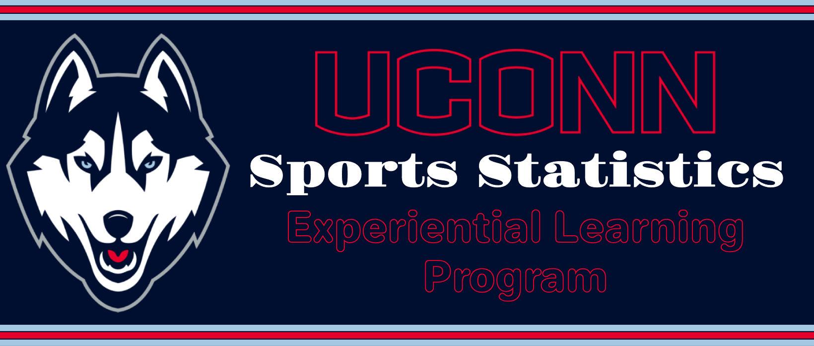
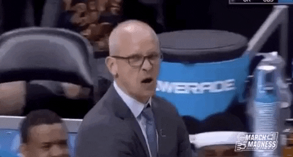

# NCAA Basketball's Turnaround Teams' Secrets

The NCAA March Madness tournaments are the most memorable sports tournaments of the year. Getting there is no easy task. The pressure is on all season long for teams to perform. 

Unfortunately, bad years are inevitable for any program. Where should your team focus its energy if you find yourself in a rut? Let's use a machine learning approach to find some of the key characteristics of NCAA basketball teams who improved their performance between the 2024 and 2025 seasons. 

## Project Description

### Background

Whether the goal is making a playoff run, just punching a ticket to the postseason, or hustling a little more than last season, every NCAA team is looking to improve its performance. 

Struggling teams may be able to use the results of this project for a data-guided improvement plan for their lineup ahead of a new season.

For college basketball fans, little is more frustrating than their team struggling!

### Objectives

This project seeks to use feature importance to identify the most impactful predictors of team improvement. 

---

# Analysis Plan

## Data Collection

Where will your data come from? How was it collected? 

## Data Cleaning

Upon cleaning your data, what information did you decide to keep?

If you had to make any contentious choices in your data cleaning process, list those here. 

## Statistical Design

What statistical methods are used in your study? Why were these selected? What might they tell you?

### Statistical Method 1

### Statistical Method 2...

---

# Conclusions

Briefly describe the conclusions supported by the findings of your study.

---

# Discussion

After having done the project, what are you still curious about? What would you like to know more? What are some potential limitations of your study? 

---

# Acknowledgements

Special thanks to the UConn Department of Statistics and the CLAS Academic Services Center.

I hope this template was helpful! Now, remember, if UConn is having a rough year on the court, we can always turn to the dairy bar!

~Jack

